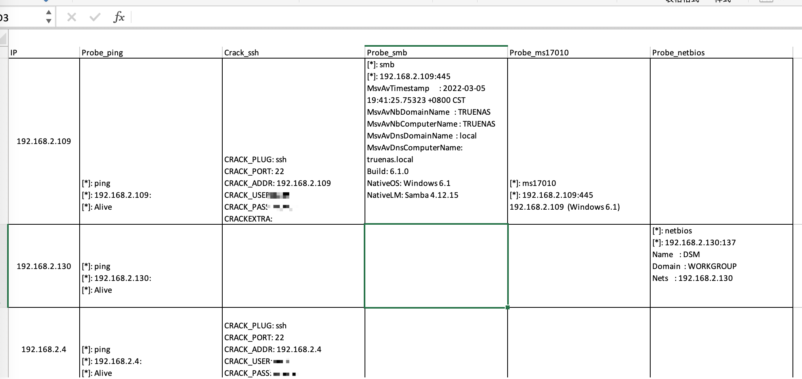

## 特点
- 方便二次开发，快速增加插件
- 支持输出结果到excel文档
- 精简运行参数


## 我什么都不想记
如果没有耐心看下面的命令选项，运行如下命令，然后打开pwn.xlsx
```
cube crack -x X -s 192.168.2.1/24 -o /tmp/pwn.xlsx
cube probe -x Y -s 192.168.2.1/24 -o /tmp/pwn.xlsx
```


## 密码爆破
#### 使用内置词典
```shell
cube crack -s 192.168.1.1 -x ssh
```
#### 指定用户密码
```shell
cube crack -l root,ubuntu -p 123,000111,root -x ssh -s 192.168.1.1
cube crack -L user.txt -P pass.txt -s 192.168.1.1/24 -x ssh
cube crack -l root -P pass.txt -s 192.168.1.1/24 -x ssh
```
#### 指定端口
```shell
cube crack -l root -p root -s 192.168.1.1 -x ssh --port 2222
```
#### 指定多个插件
```shell
# 爆破mysql和ssh(注意ssh和mysql之间的逗号不存在空格)
cube crack -s 192.168.1.1 -x ssh,mysql
```
#### 加载全部爆破插件
```shell
cube crack -x X -s 192.168.1.1
```

## 内网信息探测
#### 加载全部默认插件
```shell
# -x Y的时候加载全部probe插件， -x -X只会加载部分默认插件
cube probe -x X -s 192.168.2.1/24
cube probe -x Y -s 192.168.2.1/24
```
### 加载指定插件
```shell
cube probe -x oxid,ms17010 -s 192.168.2.1/24
```

## 输出到文档
在使用`crack`和`probe`的任何时候都可以加上`-o pwn.xlsx`，用于把结果写入到excel，当excel已经存在
的时候，cube会把当前扫描的结果自动追加到文档里。

## 全局参数
- `-v`: 输出内容更详细，一般用于调试
- `-n`: 设定`crack`和`probe`的运行线程，默认30线程
- `--delay`: 设定此选项的时候，`crack`和`probe`强制设为单线程，并在设定的值之内随机休眠
- `--timeout`: 线程运行的超时时间


## TODO
* [数据库利用工具](http://ryze-t.com/posts/2022/02/16/%E6%95%B0%E6%8D%AE%E5%BA%93%E8%BF%9E%E6%8E%A5%E5%88%A9%E7%94%A8%E5%B7%A5%E5%85%B7-Sylas.html]
* [MDUT](https://github.com/SafeGroceryStore/MDUT)


https://github.com/sairson/Yasso/blob/6a99f1143d78e4c8224e49d00c0cfae39353f893/cmd/tools.go#L100

//https://stackoverflow.com/questions/27803654/explanation-of-checking-if-value-implements-interface
https://stackoverflow.com/questions/59831642/how-to-get-a-list-of-a-structs-methods-in-go
//检查某个方法是否实现了接口：https://go.dev/play/p/tNNDukK4wRi


* 完成SQLCMD模块
  -m ls  <dst path>
  -m cat <dst file>
  -m upload <src path> <dst path>
  -m exec <cmd string>


Sqlcmd 传入多个参数：
http://liuqh.icu/2021/11/07/go/package/28-cobra/

设计一下sqlcmd的使用
cube sqlcmd -s 127.0.0.1 -l root -p root -x mssql exec "whoami"
cube sqlcmd -s 127.0.0.1 -l root -p root -x mssql upload  <src> <dst>
cube sqlcmd -s 127.0.0.1 -l root -p root -x mssql ls  <src>
cube sqlcmd -s 127.0.0.1 -l root -p root -x mssql cat  <src> 

